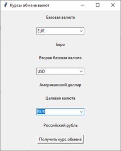

# Курс "Азбука Цифр"
## Основы Python и приладное применение с Tkinter

### 3.2. Задание 5
Добавьте в проект, разработанный на уроке, вторую базовую валюту, чтобы он выводил
сразу два курса обмена одновременно.  Получайте данные в формате JSON.
Добавьте еще одно поле для выбора второй базовой валюты.
Измените функцию exchange так, чтобы она запрашивала и отображала
курсы обмена для обеих базовых валют относительно выбранной целевой валюты.
При выполнении домашнего задания используйте Git и сделайте не менее трех коммитов.

### 3.2. Задание 6
Создайте приложение с графическим интерфейсом на языке Python, которое будет отображать
текущие курсы популярных криптовалют к доллару США,
используя данные открытого API CoinGecko. https://www.coingecko.com/en/api . 
При выполнении домашнего задания используйте Git и сделайте не менее трех коммитов.
Оформите техническое задание на разработку этого приложения.
Не забудьте добавить в него эскиз интерфейса.
